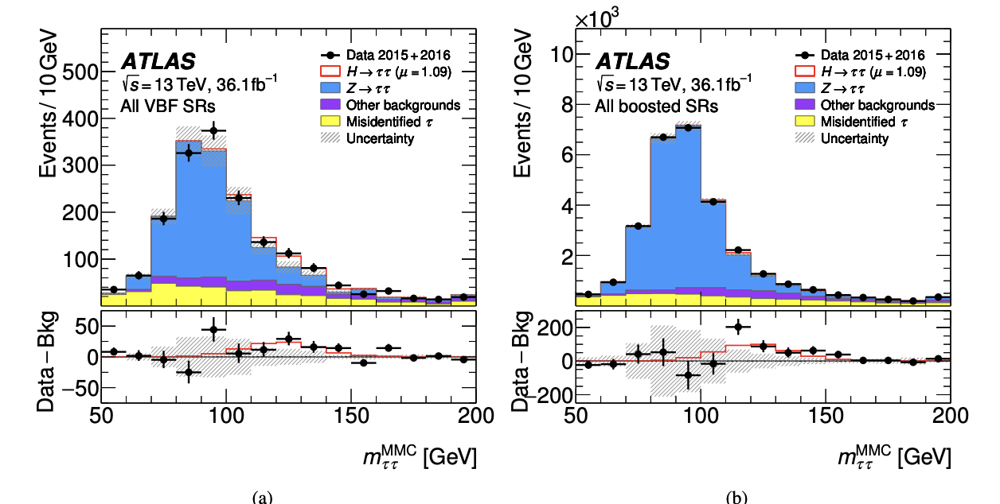
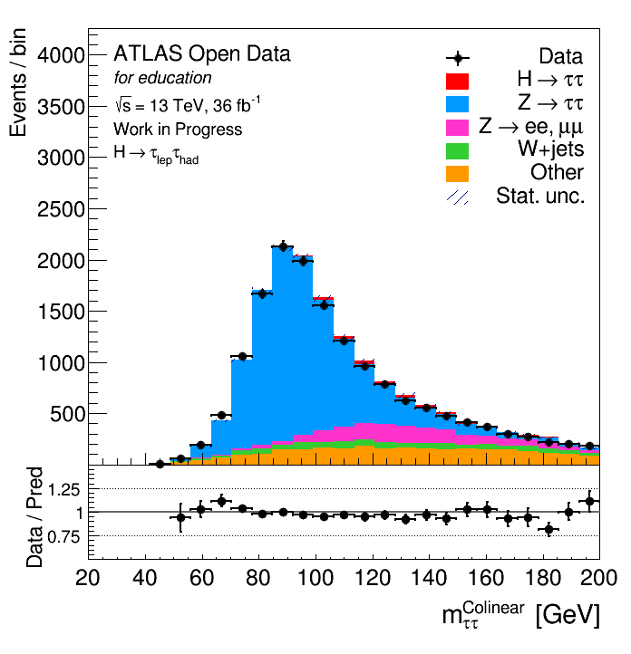

# HTauTauAnalysis
## Description
The $\tau$-lepton is a key object in the study of the Higgs boson at the LHC.  
The $H\rightarrow \tau\tau$ decay channel plays a central role in testing the Yukawa coupling of the Higgs to leptons, providing direct evidence for the fermionic nature of Higgs interactions.  

Since $\tau$-leptons appear in both the signal and in several important Standard Model processes such as $Z\rightarrow \tau\tau$, $W\rightarrow \tau\nu$, and top-quark decays, their reconstruction and identification are essential not only for Higgs measurements but also for searches for new physics beyond the SM.

In this analysis, the focus is on reconstructing $H\rightarrow \tau\tau$ decays in the lepton–hadron final state, where one $\tau$-lepton decays hadronically ($\tau_h$) and the other decays leptonically into an electron or muon.  

- Hadronic $\tau$ decays are reconstructed as narrow jets characterized by an odd number of charged hadrons, often accompanied by neutral pions depositing energy in the calorimeter.  
- Leptonic $\tau$ decays provide a clean electron or muon signature in the detector, suitable for triggering and precise reconstruction.

---

## Event selection

The event selection is designed to suppress major backgrounds such as $Z \to \ell\ell$, $W+$jets, and top-quark production, while enhancing the sensitivity to the $H \to \tau\tau$ signal.  

Selection criteria:

- **Trigger:** Event must pass either a single-electron or a single-muon trigger.
- **Lepton selection ($\tau_{\text{lep}}$):**
  - Exactly one isolated electron or muon is required.
  - Medium identification; isolation is loose for electrons and tight for muons.
  - Must be matched to the trigger object.
  - Kinematic requirements:
    - Electrons: $p_T > 21$ GeV, $|\eta| < 2.47$, excluding $1.37 < |\eta| < 1.52$.
    - Muons: $p_T > 27.3$ GeV, $|\eta| < 2.5$.
- **Hadronic tau selection ($\tau_{\text{had}}$):**
  - Exactly one hadronic tau candidate, passing tight identification.
  - $p_T > 30$ GeV, $|\eta| < 2.5$.
- **Charge requirement:** The lepton and hadronic tau must have opposite charges.
- **Missing transverse energy:** $E_T^{\text{miss}} > 20$ GeV.
- **Transverse mass:** $m_T(\ell, E_T^{\text{miss}}) < 70$ GeV.
- **Angular requirements:**
  - $\Delta R(\ell, \tau_h) < 2.5$
  - $|\Delta \eta(\ell, \tau_h)| < 1.5$
- **Visible invariant mass:** $35 < m_{\text{vis}} < 180$ GeV.
- **Collinear mass reconstruction:** Events are rejected if the collinear approximation fails or if  
  $x_1 \notin [0.1, 1.4]$ or $x_2 \notin [0.1, 1.2]$.

With these selections, the reconstructed di-tau invariant mass distribution can be studied and compared between data and MC simulation, providing both a validation of the $\tau$ reconstruction performance and a measurement of the Higgs signal over the dominant backgrounds.

---

## Comparison

### ATLAS (Reference)

- **Observable:** $m_{\tau\tau}^{\mathrm{MMC}}$ (Missing Mass Calculator), using full kinematic information and missing transverse energy.
- **Selections:**
  1. All VBF signal regions (Vector Boson Fusion).
  2. All boosted signal regions ($\tau\tau$ with large $p_T$).
- **Histograms:** Stacked MC contributions ($Z\to\tau\tau$, $H\to\tau\tau$, fakes, other backgrounds).  
  Data are shown as black points. The hatched band indicates total uncertainty (stat + syst).  
  The solid red line shows the signal+background prediction from the fit with $\mu = 1.09$.
- **Lower panels:** Show (Data $-$ Bkg) to visualize the excess compatible with the Higgs boson signal.
- **Expected result:** A small excess around 125 GeV corresponding to $H\to\tau\tau$.

---

### Our plot

- **Observable:** $m_{\tau\tau}^{\mathrm{Collinear}}$, a simpler approximation assuming neutrinos are collinear with the visible $\tau$ leptons.
- **Selection:** ATLAS Open Data educational sample ($H \to \tau_\ell \tau_{\mathrm{had}}$).
- **Histograms:** Stacked MC contributions: $Z\to\tau\tau$ (dominant), $H\to\tau\tau$ (small red peak), $W+$jets, other leptonic processes.  
  Data = black points, hatched band = statistical uncertainty only (no systematics).
- **Lower panel:** Ratio Data/Prediction.

---

### Comparison of the two methods

- **Reconstruction quality:**  
  - MMC → better resolution, sharper Higgs peak at ~125 GeV.  
  - Collinear → simpler, broader tail, degraded resolution.  

- **Data–MC agreement:**  
  - Both: $Z\to\tau\tau$ dominates around ~90 GeV.  
  - $H\to\tau\tau$ signal = small excess above background.  
  - Our Data/Pred ratio ~1, but with larger fluctuations (educational data, not fully calibrated).  

- **Notable differences:**  
  - ATLAS paper: full likelihood fit, global adjustment → controlled uncertainties, explicit (Data $-$ Bkg) panel.  
  - Our plot: no fit, direct Data vs. normalized MC comparison → only stat uncertainties, no residuals panel.  
  - Higgs bump at 125 GeV is less visible with collinear mass reconstruction than with MMC.